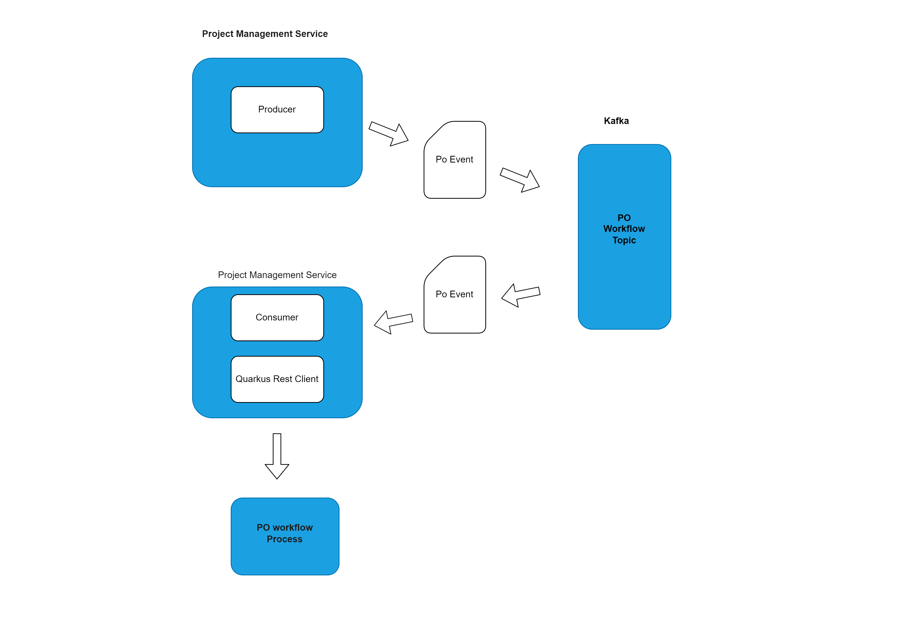

# Project-Management

This project uses Quarkus, Java Framework.

## Table of Contents

1. [Project Structure](#project-structure)
2. [Configurations](#configurations)
3. [Workflows](#workflows)
4. [Running the application in dev mode](#running-the-application-in-dev-mode)
5. [Packaging and running the application](#packaging-and-running-the-application)
6. [Dockerizing the application](#dockerizing-the-application)
7. [Creating a native executable](#creating-a-native-executable)

## Project Structure

## Workflows

### Po Event Triggering the Workflow



## Configurations

### Kafka Producer Configuration

```java
mp.messaging.outgoing.po-out.connector=smallrye-kafka
mp.messaging.outgoing.po-out.topic=po-workflow
mp.messaging.outgoing.po-out.key.serializer=org.apache.kafka.common.serialization.StringSerializer
mp.messaging.outgoing.po-out.value.serializer=io.quarkus.kafka.client.serialization.ObjectMapperSerializer

```

### Kafka Consumer Configuration

```java
mp.messaging.incoming.po-in.connector=smallrye-kafka
mp.messaging.incoming.po-in.topic=po-workflow
mp.messaging.incoming.po-in.key.deserializer=org.apache.kafka.common.serialization.StringDeserializer
mp.messaging.incoming.po-in.value.deserializer=com.zaga.consumer.MailDeserializer

```

### Quarkus Rest Client Configuration

```java
quarkus.rest-client.pdf-api.url=http://localhost:8080/Zaga/document-service
quarkus.rest-client.pdf-api.scope=javax.inject.Singleton

```

## Running the application in dev mode

You can run your application in dev mode that enables live coding using:

```shell script
./mvnw compile quarkus:dev
```

> **_NOTE:_** Quarkus now ships with a Dev UI, which is available in dev mode only at http://localhost:8080/q/dev/.

## Packaging and running the application

The application can be packaged using:

```shell script
./mvnw package
```

It produces the `quarkus-run.jar` file in the `target/quarkus-app/` directory.
Be aware that it’s not an _über-jar_ as the dependencies are copied into the `target/quarkus-app/lib/` directory.

The application is now runnable using `java -jar target/quarkus-app/quarkus-run.jar`.

If you want to build an _über-jar_, execute the following command:

```shell script
./mvnw package -Dquarkus.package.type=uber-jar
```

The application, packaged as an _über-jar_, is now runnable using `java -jar target/*-runner.jar`.

## Dockerizing the application

First Package the Application

```shell script
./mvnw package
```

Create the Docker image using Docker daemon

```shell script
docker build -t projectmanagement-quarkus-app -f src/main/docker/Dockerfile.jvm .
```

Run the container

```shell script
 docker run -d -p 8081:8081 projectmanagement-quarkus-app
```

## Creating a native executable

You can create a native executable using:

```shell script
./mvnw package -Pnative
```

Or, if you don't have GraalVM installed, you can run the native executable build in a container using:

```shell script
./mvnw package -Pnative -Dquarkus.native.container-build=true
```

You can then execute your native executable with: `./target/project-management-1.0.0-SNAPSHOT-runner`

If you want to learn more about building native executables, please consult https://quarkus.io/guides/maven-tooling.

## Related Guides

- MongoDB with Panache ([guide](https://quarkus.io/guides/mongodb-panache)): Simplify your persistence code for MongoDB via the active record or the repository pattern
- SmallRye OpenAPI ([guide](https://quarkus.io/guides/openapi-swaggerui)): Document your REST APIs with OpenAPI - comes with Swagger UI
- RESTEasy Reactive ([guide](https://quarkus.io/guides/resteasy-reactive)): A JAX-RS implementation utilizing build time processing and Vert.x. This extension is not compatible with the quarkus-resteasy extension, or any of the extensions that depend on it.

## Provided Code

### RESTEasy Reactive

Easily start your Reactive RESTful Web Services

[Related guide section...](https://quarkus.io/guides/getting-started-reactive#reactive-jax-rs-resources)
